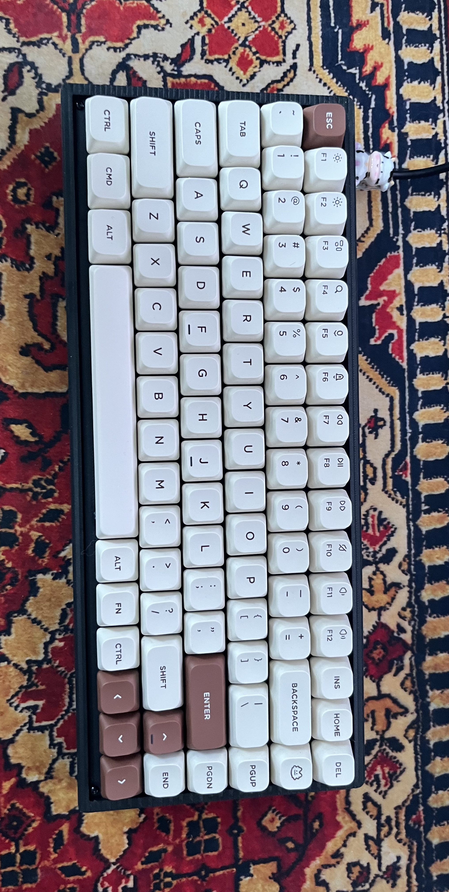
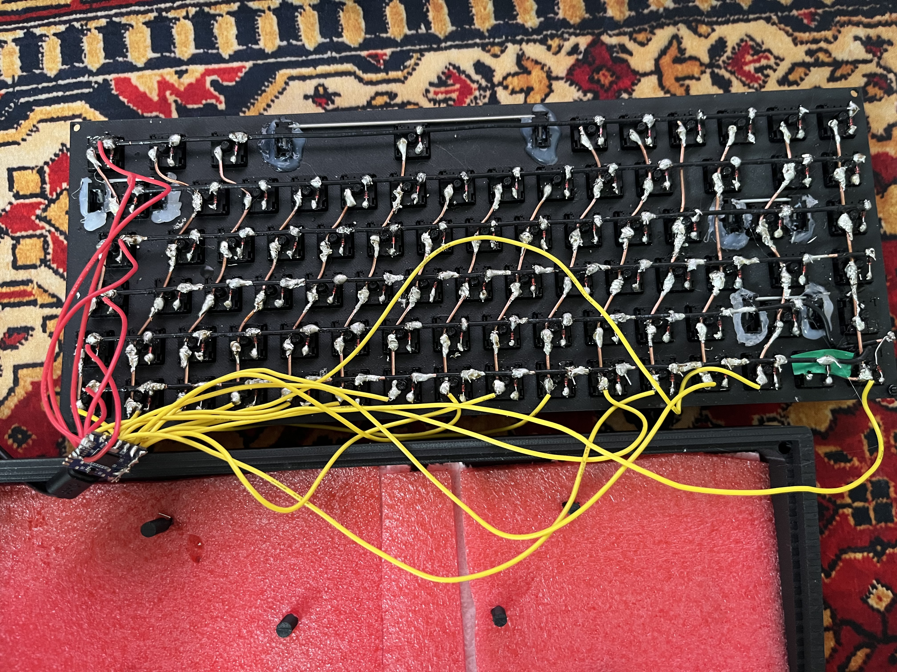

# handwired/damian1




A handwired QMK keyboard built with a simple row/column matrix (wires + diodes) and a microcontroller running QMK firmware.

- Keyboard Maintainer: [Damian](https://github.com/demkoz)
- Hardware Supported: Handwired matrix + a QMK-supported controller RP2040-Zero
- Hardware Availability: Handwired build (no PCB). Controller and parts can be sourced from common electronics/keyboard stores.



## Design

- **Layout**: Custom layout designed from scratch (key positions, spacing, and overall arrangement).
- **Enclosure**: Fully custom **3D-printed case** designed by me, including internal mounts and cable routing.

3D files (STL/STEP): please write directly to me.

## How this keyboard was built

1. **Layout**
   - Chosen layout and key count.
   - Defined the matrix size (rows/columns) to minimize wiring.

2. **Electronics**
   - Used a microcontroller supported by QMK (example: Pro Micro / Elite-C / RP2040-based controller).
   - Added **one diode per switch** for proper matrix scanning and to prevent ghosting.

3. **Wiring the matrix**
   - Each switch connects a **row** wire to a **column** wire.
   - Diodes are installed consistently in one direction across the whole keyboard.
   - Rows/columns are connected to the controller pins defined in `config.h`.

4. **QMK integration**
   - Created the keyboard folder: `keyboards/handwired/damian1/`
   - Added/edited the standard QMK files (depending on your setup):
     - `keyboard.json` or `info.json` (layout / metadata)
     - `config.h` (matrix pins, diode direction, etc.)
     - `rules.mk` (features, MCU settings)
     - `keymaps/default/keymap.c` (default keymap)

## Hardware details

- Controller: *RP2040-Zero*
- Switches: *MX Cherry Silent Red*
- Diodes: *1N4148*
- Keycaps: *Nuphy Gem Keycaps mSA Double-shot PBT*
- Matrix: *5 rows x 14 columns*
- Diode Direction in QMK: *ROW2COL*
- Notes: *The whole keyboard was wired using copper wire and heat shrink tubing. The diodes were soldered to copper wire in rows, and columns were directly soldered to the switches. *

## Building the firmware

After setting up your QMK build environment, build with:

```bash
qmk compile -kb handwired/damian1 -km default

Or using make:

make handwired/damian1:default

Flashing

qmk flash -kb handwired/damian1 -km default

Or using make:

make handwired/damian1:default:flash

See the QMK docs for setup and build instructions:

    Build tools setup: https://docs.qmk.fm/#/getting_started_build_tools

    Make guide: https://docs.qmk.fm/#/getting_started_make_guide

    Newbs guide: https://docs.qmk.fm/#/newbs


```
## Overal feeling

Before assebling the keyboard I personally lubed every switch, which changed the switch sound. The Cherry MX Silent Red has a hearable spring, which can be annoying, and after lubing the switches, the keyboard is almost soundless and has a very nice feel when typing. 


